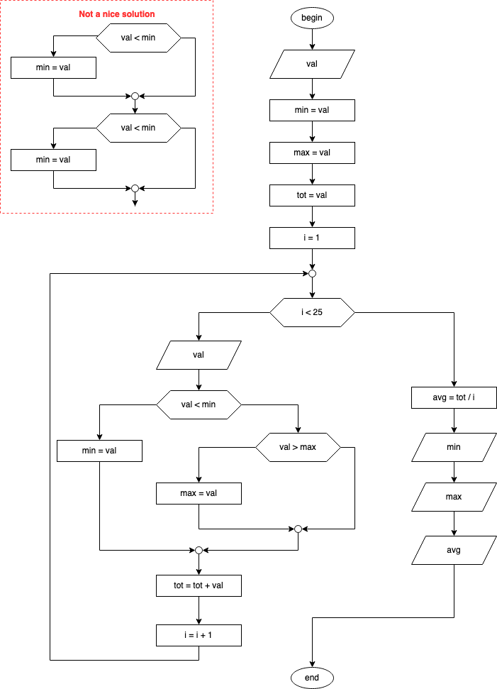

Write an algorithm that receives in input an integer value and outputs 1 if it is odd, 0 otherwise

---

Write an algorithm that receives in input an integer value `num` and outputs all odd numbers strictly smaller than `num`

---

Write an algorithm that receives in input a positive integer and keeps repeating the acquisition if the constraint is not met, and computes and outputs its factorial.
Let us recall that `0!` and `1!` are both 1.

---

Write an algorithm that receives in input a sequence of 25 integers and computes and outputs minimum, maximum and average of the sequence.

---

Write an algorithm that computes and outputs the first 10 numbers of Fibonacci's series (e.g., 1 1 2 3 ...)

---

Modify the previous algorithm to ask the user how many numbers of Fibonacci's sequence should be computed and printed, and then outputs them.

---

Write an algorithm that receives in input a sequence of characters, concluded when the user inputs `'*'` and computes and outputs the number of vowels in the input sequence.
